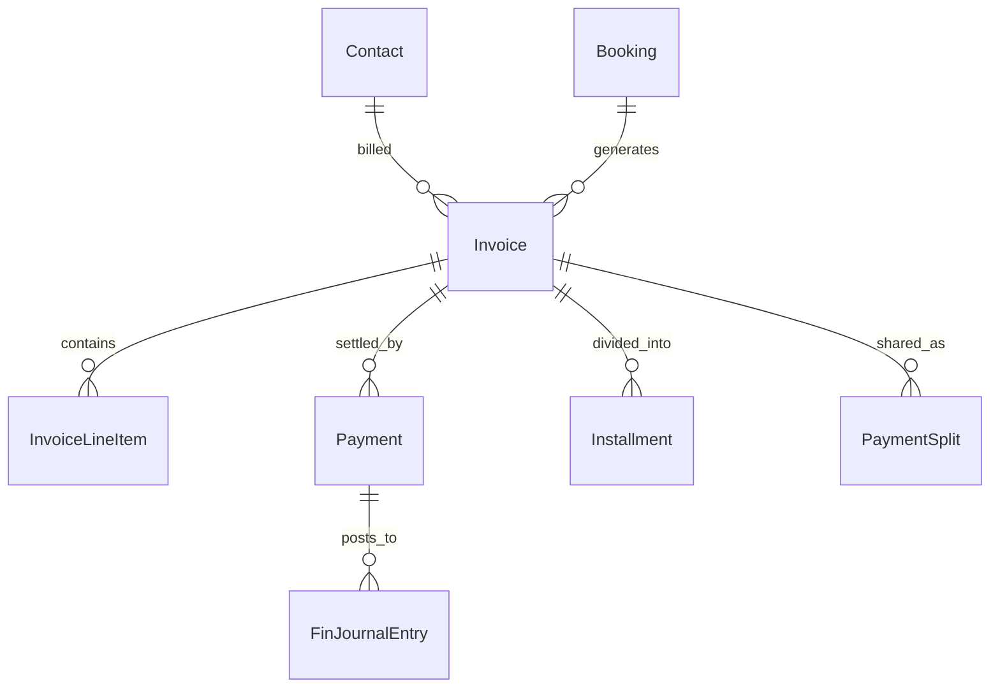

# 33 - Invoice & Payment Database Model

---

## 🗄️ Entity Relationship Diagram

```mermaid
erDiagram
    Contact ||--o{ Invoice : "billed"
    Booking ||--o{ Invoice : "generates"
    Invoice ||--o{ InvoiceLineItem : "contains"
    Invoice ||--o{ Payment : "settled_by"
    Invoice ||--o{ Installment : "divided_into"
    Invoice ||--o{ PaymentSplit : "shared_as"
    Payment ||--o{ FinJournalEntry : "posts_to"
```
