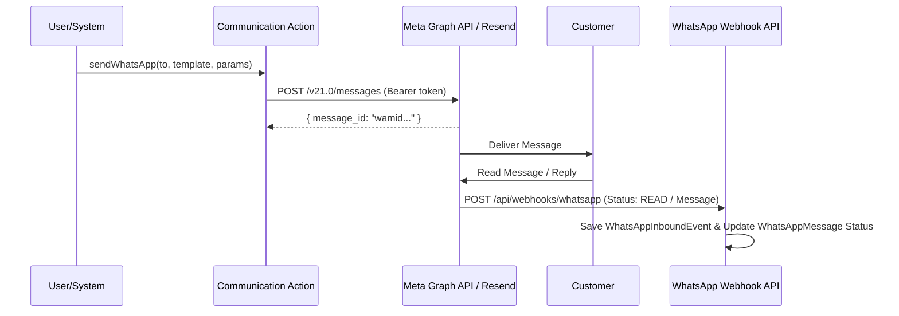

# 26 Data Flows

`CODE VERIFIED`

```mermaid
sequenceDiagram
    participant User/System
    participant CommsService as Communication Action
    participant MetaAPI as Meta Graph API / Resend
    participant Customer
    participant Webhook as WhatsApp Webhook API

    User/System->>CommsService: sendWhatsApp(to, template, params)
    CommsService->>MetaAPI: POST /v21.0/messages (Bearer token)
    MetaAPI-->>CommsService: { message_id: "wamid..." }
    MetaAPI->>Customer: Deliver Message
    Customer->>MetaAPI: Read Message / Reply
    MetaAPI->>Webhook: POST /api/webhooks/whatsapp (Status: READ / Message)
    Webhook->>Webhook: Save WhatsAppInboundEvent & Update WhatsAppMessage Status
```
