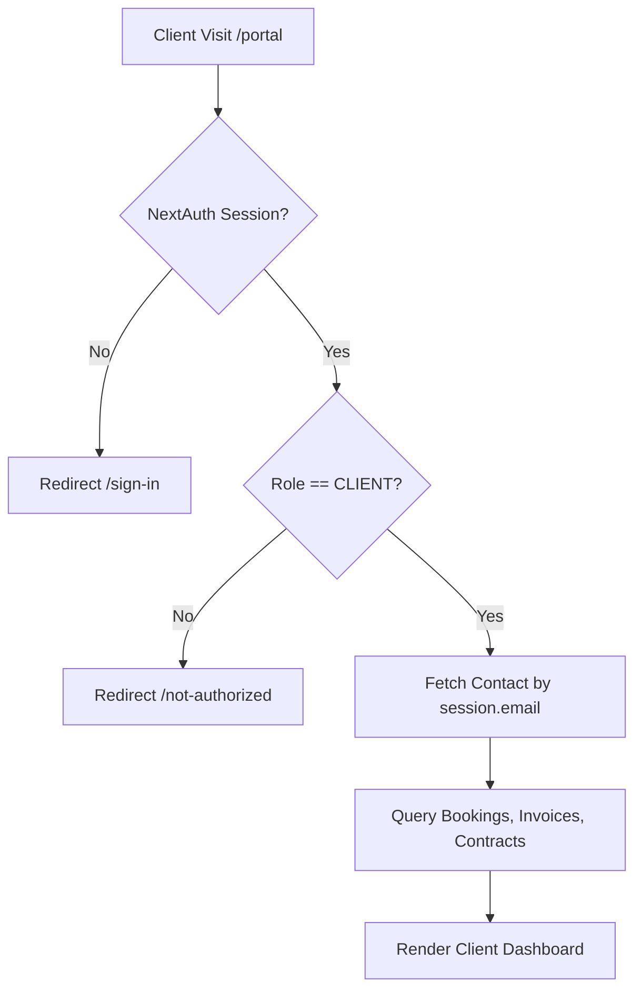

# 37 End-to-End Portal Data Flow Diagrams

`CODE VERIFIED`

## Client Portal Data Flow

```mermaid
flowchart TD
    A[Client Visit /portal] --> B{NextAuth Session?}
    B -- No --> C[Redirect /sign-in]
    B -- Yes --> D{Role == CLIENT?}
    D -- No --> E[Redirect /not-authorized]
    D -- Yes --> F[Fetch Contact by session.email]
    F --> G[Query Bookings, Invoices, Contracts]
    G --> H[Render Client Dashboard]
```
