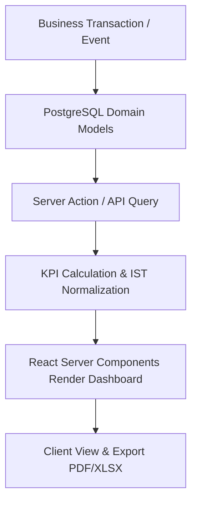
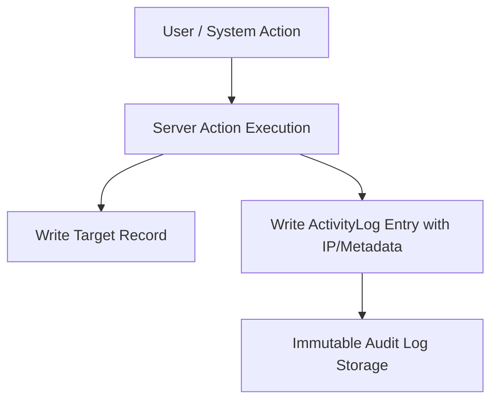

# 57 Executive Analytics & Audit Data Flow Diagrams

`CODE VERIFIED`

## Analytics Data Flow Diagram

```mermaid
flowchart TD
    A[Business Transaction / Event] --> B[PostgreSQL Domain Models]
    B --> C[Server Action / API Query]
    C --> D[KPI Calculation & IST Normalization]
    D --> E[React Server Components Render Dashboard]
    E --> F[Client View & Export PDF/XLSX]
```

## Audit Trail Data Flow Diagram

```mermaid
flowchart TD
    A[User / System Action] --> B[Server Action Execution]
    B --> C[Write Target Record]
    B --> D[Write ActivityLog Entry with IP/Metadata]
    D --> E[Immutable Audit Log Storage]
```
