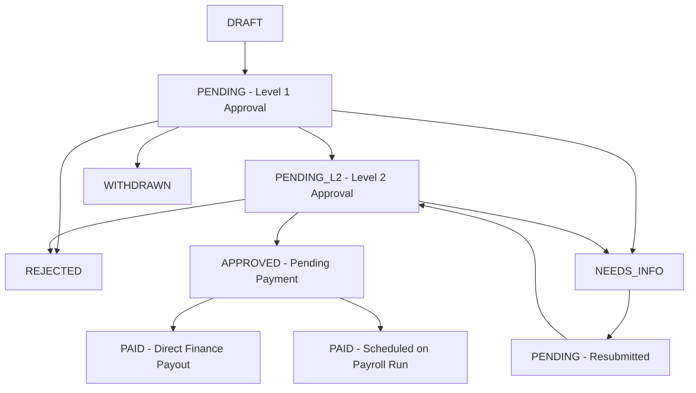

# 06 Enums & State Machine Specifications

`CODE VERIFIED`

## Claim Lifecycle State Machine

### State Transition Rules
1. **`PENDING`**: Awaiting Level 1 approval.
2. **`PENDING_L2`**: Level 1 approved; awaiting Level 2 (Department/HR) approval.
3. **`APPROVED`**: Level 1 & Level 2 approved. Claim is now visible to Finance and HR Payroll.
4. **`PAID`**: Terminal settlement state reached either via direct payment (`markReimbursementPaid`) or payroll run posting (`runId`).
