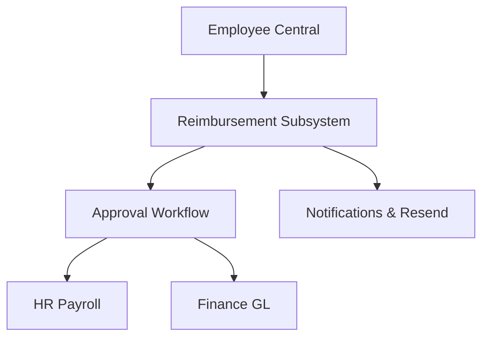

# 27 Subsystem Dependency Map

`CODE VERIFIED`

```mermaid
flowchart TD
    EmployeeCentral[Employee Central] --> Reimbursement[Reimbursement Subsystem]
    Reimbursement --> ApprovalWorkflow[Approval Workflow]
    ApprovalWorkflow --> HR[HR Payroll]
    ApprovalWorkflow --> Finance[Finance GL]
    Reimbursement --> Notifications[Notifications & Resend]
```
