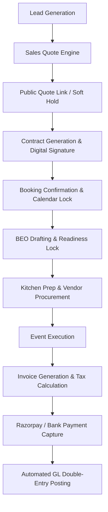

# Phase 10: Master Business Process Map

## Core Workflows
1. **Event Sales Lifecycle**: Lead -> Quote -> Contract -> Booking -> BEO -> Event -> Invoice -> Payment -> GL.
2. **Property Acquisition**: Property Lead -> Acquisition Deal -> Lease Contract -> Property Master -> Venue Sales.
3. **Marketing Attribution**: Ad Campaign -> Multi-Channel Track -> Lead -> Quotation -> Revenue Attribution.
4. **Recruitment to Onboarding**: Open Position -> Applicant -> Interview -> Offer Letter -> Employee Master -> Payroll.
5. **Attendance & Payroll**: Biometric Sync -> Attendance Log -> Leave LOP -> 30-Day Fixed Payroll -> Payslip -> GL Posting.
6. **Procurement & AP**: Requisition -> Work Order / PO -> Goods Receipt -> Vendor Bill -> AP -> Disbursed Payment -> GL.
