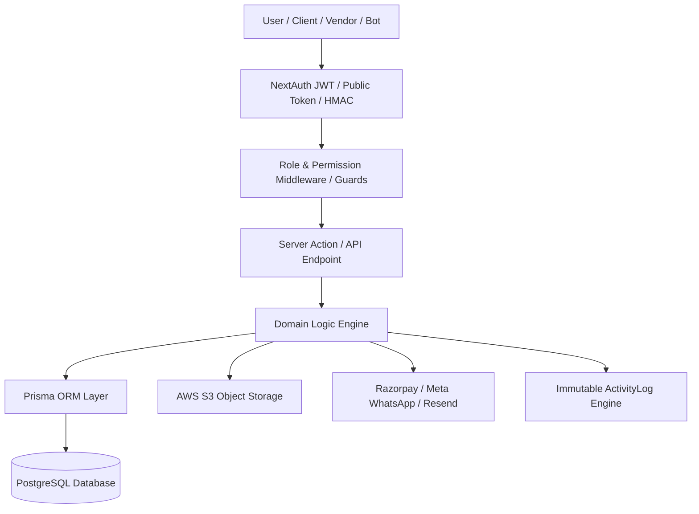

# Phase 11: Master Data Flow

```mermaid
graph TD
    USER[User / Client / Vendor / Bot] --> AUTH[NextAuth JWT / Public Token / HMAC]
    AUTH --> RBAC[Role & Permission Middleware / Guards]
    RBAC --> ACTION[Server Action / API Endpoint]
    ACTION --> DOMAIN[Domain Logic Engine]
    DOMAIN --> PRISMA[Prisma ORM Layer]
    PRISMA --> DB[(PostgreSQL Database)]
    DOMAIN --> S3[AWS S3 Object Storage]
    DOMAIN --> EXT[Razorpay / Meta WhatsApp / Resend]
    DOMAIN --> AUDIT[Immutable ActivityLog Engine]
```
