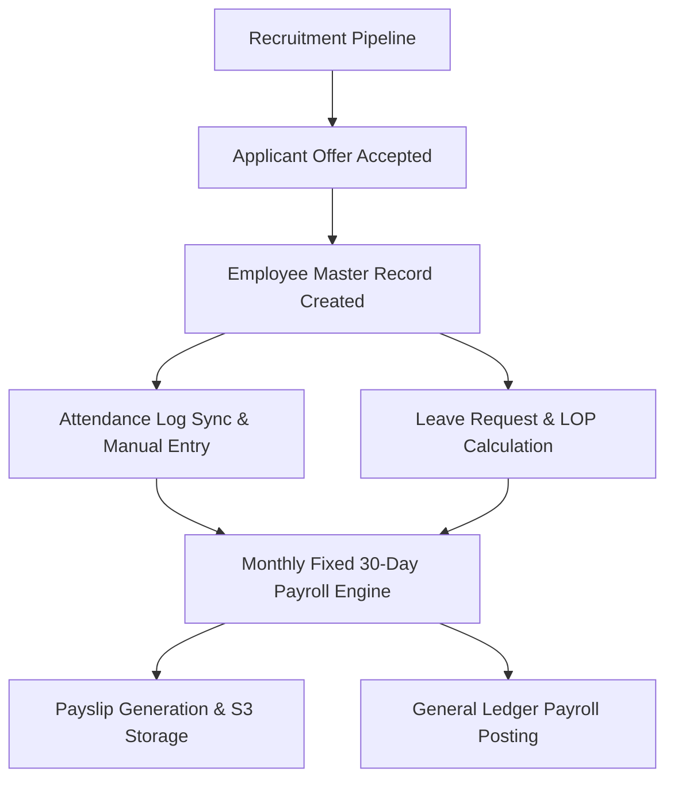

# Phase 17: Master HR Flow

## Fixed 30-Day Denominator Rule
- Salary calculation formula: `paidDays = 30 - LOP`.
- `dailyRate = monthlyBaseSalary / 30.0`.
- Working days count in calendar month does not alter the fixed 30-day denominator.
