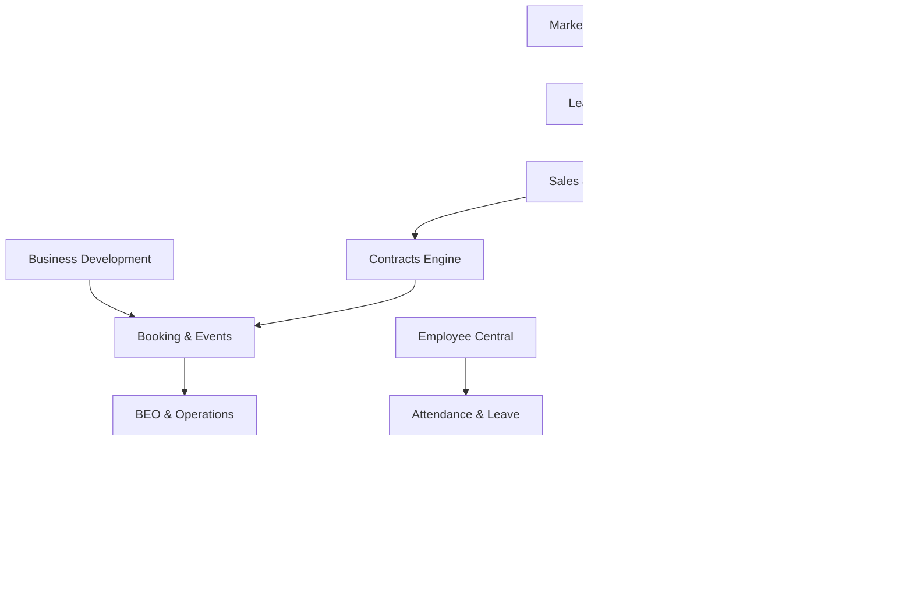

# Phase 31: Master Dependency Graph

```mermaid
graph TD
    MKT[Marketing Module] --> CRM[Lead CRM]
    BD[Business Development] --> BOOK[Booking & Events]
    CRM --> SALES[Sales & Quotation]
    SALES --> CONT[Contracts Engine]
    CONT --> BOOK
    BOOK --> BEO[BEO & Operations]
    BEO --> KITCH[Kitchen & Inventory]
    BEO --> PROC[Vendor & Procurement]
    SALES --> INV[Invoicing & Payments]
    INV --> FIN[Finance & General Ledger]
    PROC --> FIN
    HR[Employee Central] --> ATT[Attendance & Leave]
    ATT --> PAY[Payroll Engine]
    PAY --> FIN
    REIMB[Reimbursements] --> FIN
```
