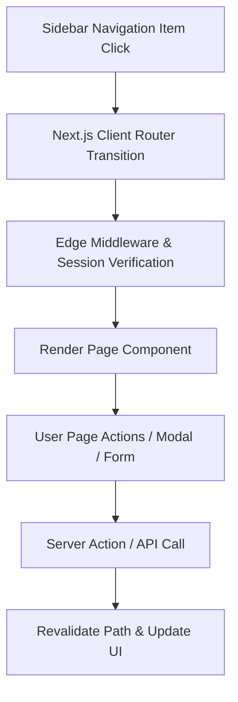

# Navigation Interaction & User Journey Map

## 1. Navigation Flow Sequence

## 2. Quick Navigation Shortcuts
1. **Command Palette (`Cmd + K`)**: Component at `src/components/layout/command-palette.tsx` allowing instant fuzzy search across all navigation items.
2. **Workspace Pins Bar**: Custom pins bar rendered via `useWorkspacePins()` allowing 1-click access to top 6 pinned items.
3. **Breadcrumbs Bar**: Header component (`src/components/layout/app-header.tsx`) providing instant parent navigation links.
